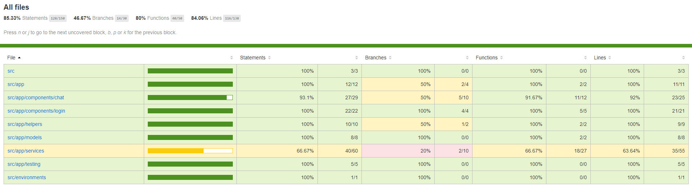

# Chat-app

Petite page qui permet à des utilisateurs connectés de s'envoyer des messages.

- Responsive design
- Sauvegarde de l'historique (côté serveur)
- Un seul utilisateur par onglet du navigateur
- N utilisateurs

## Pour commencer

Télécharger le projet

### Installation

- Ouvrir une invite de commande
- Aller à la racine du projet
- Faire `npm install`

## Démarrage

- Ouvrir une invite de commande
- Aller à la racine du projet
- Faire `ng start`

Si vous avez cette erreur :
(node:23144) [DEP0148] DeprecationWarning: Use of deprecated folder mapping "./" in the "exports" field module resolution of the package at \chat-app\node_modules\postcss\package.json.
Update this package.json to use a subpath pattern like "./\*".
(Use `node --trace-deprecation ...` to show where the warning was created)

Pour la résoudre :

- Aller dans ce fichier \chat-app\node_modules\postcss\package.json
- Remplacer "./": "./" par "./_": "./_"

## Fabriqué avec

- [jsonwebtoken](https://www.npmjs.com/package/jsonwebtoken) - JWT Token
- [crypto-js](https://www.npmjs.com/package/crypto-js) - crypto Mot de passe
- [socket.io-client](https://socket.io/docs/v3/client-api/index.html) - Temps réel (Client)
- [socket.io](https://socket.io/) - Temps réel (Serveur)
- [material-design-icons](https://materialdesignicons.com/) - Icons
- [Visual Studio Code](https://code.visualstudio.com/download) - Editeur de textes
- [npm-run-all](https://www.npmjs.com/package/npm-run-all) - Lancement du front et back en parallèle avec juste un npm start

## Test

- `Google Chrome` Version 90.0.4430.85 (Official Build) (64-bit) => PC
- `Google Chrome` Version 87.0.4280.163 => Iphone + Ipad
- `Safari` Version 14.0.3 (version 14610.4.3.1.7 et 15610.4.3.1.7) => Iphone + Ipad
- `Microsoft Edge` Version 90.0.818.46 (Official build) (64-bit) => PC
- `Firefox` Version 88.0 (Official build) (64-bit) => PC

## Tests unitaires

- Ouvrir une invite de commande
- Aller à la racine du projet
- Faire `ng test --code-coverage`

Couverture actuelle :

## Versions

**Dernière version :** 1.0

## Auteurs

- **Cecilia Parlant** _alias_ [@cecilia-par](https://github.com/cecilia-par)

## License

Ce projet est sous licence `GNU Lesser General Public License (LGPL), version 3`
